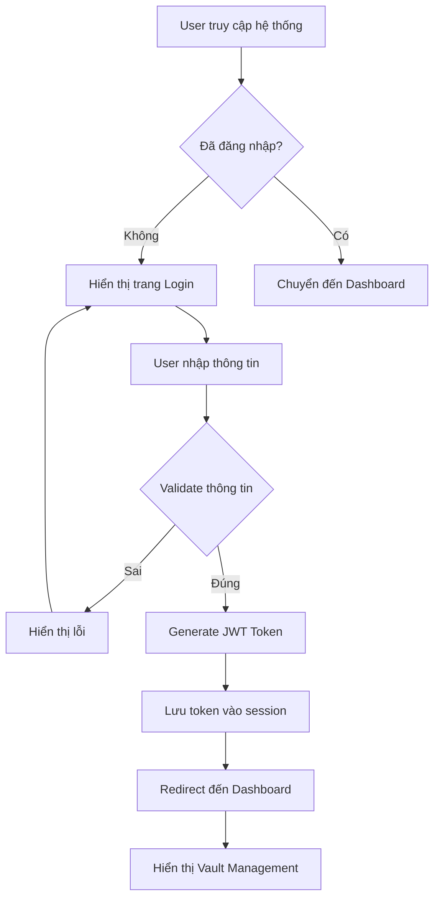
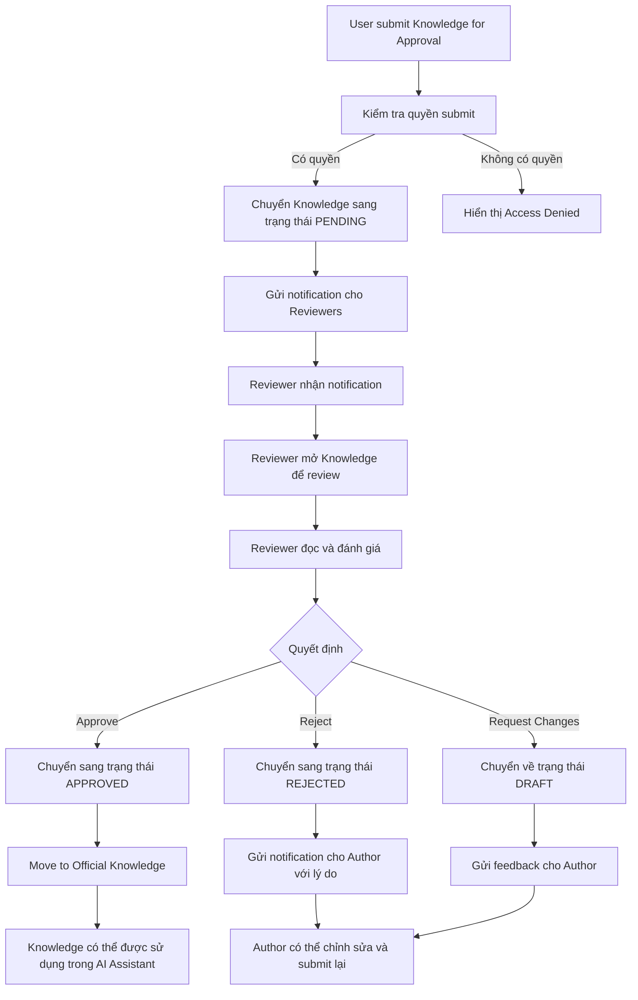
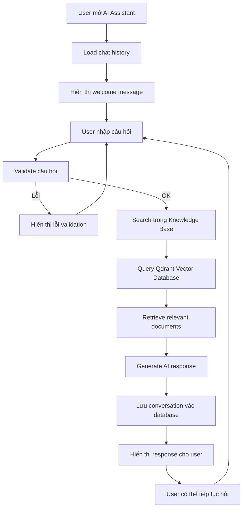
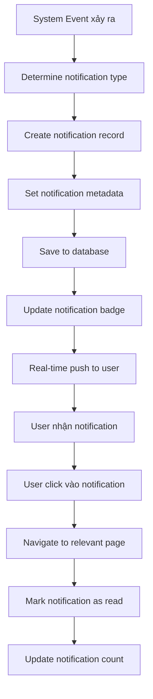
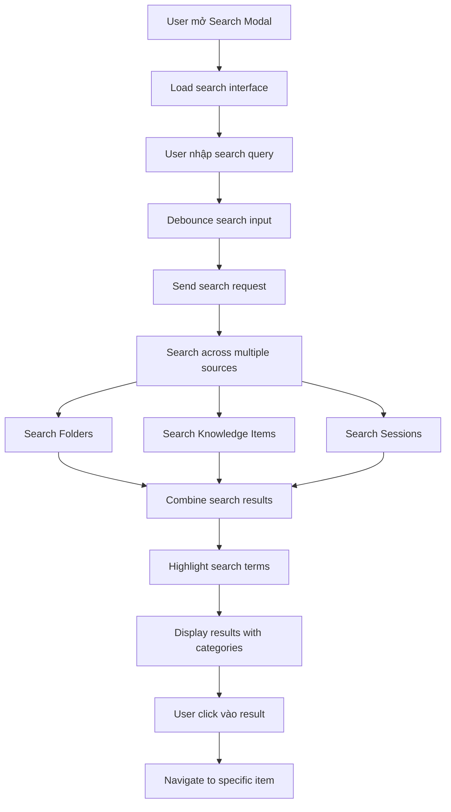
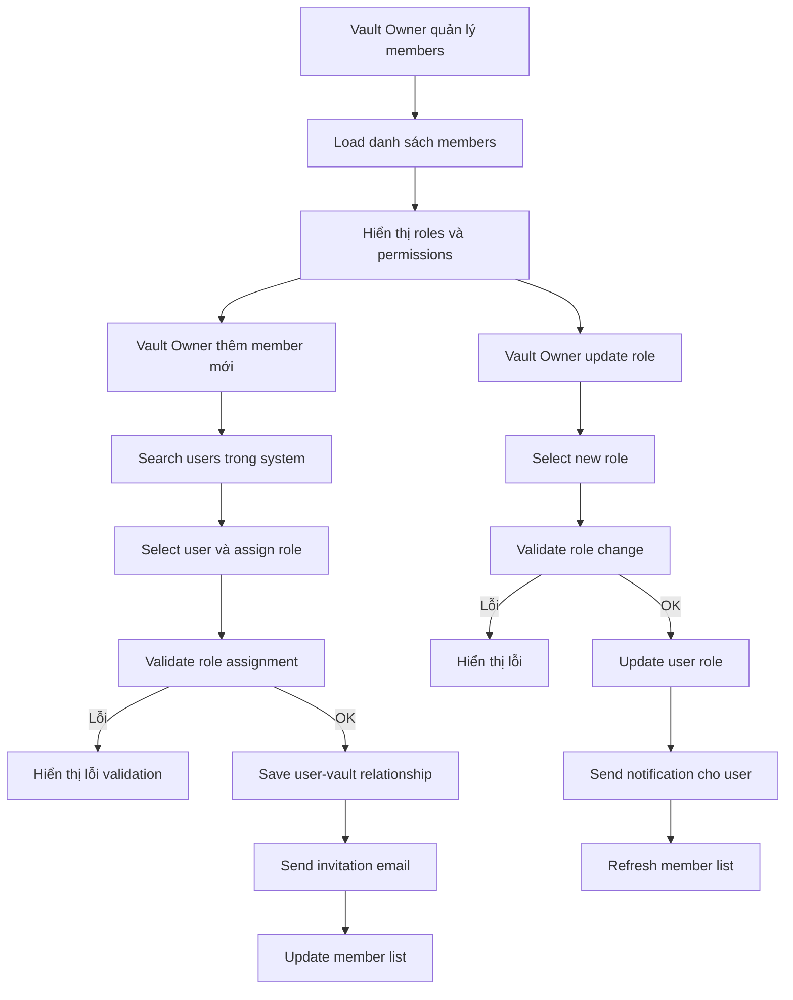

# HiveWise KMS - Workflow Chính

## 1. Workflow Đăng nhập và Xác thực



## 2. Workflow Quản lý Vault

```mermaid
graph TD
    A[User truy cập Vault Management] --> B[Hiển thị danh sách Vault]
    B --> C{User có quyền tạo Vault?}
    
    C -->|Có| D[Hiển thị nút "Create Vault"]
    C -->|Không| E[Chỉ hiển thị Vault được phân quyền]
    
    D --> F[User tạo Vault mới]
    F --> G[Validate thông tin Vault]
    G -->|Lỗi| H[Hiển thị thông báo lỗi]
    G -->|OK| I[Lưu Vault vào database]
    
    I --> J[Phân quyền VAULT_OWNER cho user]
    J --> K[Redirect về Vault Management]
    
    E --> L[User chọn Vault]
    L --> M[Kiểm tra quyền truy cập]
    M -->|Có quyền| N[Chuyển đến Vault Detail]
    M -->|Không có quyền| O[Hiển thị Access Denied]
```

## 3. Workflow Vault Detail - Quản lý Folder

```mermaid
graph TD
    A[User vào Vault Detail] --> B[Load cấu trúc folder]
    B --> C[Hiển thị Personal & Official folders]
    
    C --> D{User có quyền tạo folder?}
    D -->|Có| E[Hiển thị nút "Add Folder"]
    D -->|Không| F[Chỉ hiển thị folder hiện có]
    
    E --> G[User tạo folder mới]
    G --> H[Validate tên folder]
    H -->|Lỗi| I[Hiển thị lỗi validation]
    H -->|OK| J[Lưu folder vào database]
    
    J --> K[Refresh cấu trúc folder]
    K --> L[Hiển thị folder mới]
    
    F --> M[User chọn folder]
    M --> N[Load danh sách Knowledge Items]
    N --> O[Hiển thị Knowledge Items trong folder]
```

## 4. Workflow Quản lý Knowledge Items

```mermaid
graph TD
    A[User chọn folder] --> B[Load Knowledge Items]
    B --> C[Hiển thị danh sách Knowledge]
    
    C --> D{User có quyền tạo Knowledge?}
    D -->|Có| E[Hiển thị nút "Create Knowledge"]
    D -->|Không| F[Chỉ hiển thị Knowledge Items]
    
    E --> G[User tạo Knowledge mới]
    G --> H[Rich Text Editor]
    H --> I[User nhập title, content, tags]
    I --> J[Validate thông tin]
    J -->|Lỗi| K[Hiển thị lỗi validation]
    J -->|OK| L[Lưu Knowledge vào database]
    
    L --> M[Sync với Qdrant Vector Database]
    M --> N[Refresh danh sách Knowledge]
    
    F --> O[User chọn Knowledge Item]
    O --> P[Hiển thị chi tiết Knowledge]
    P --> Q[User có thể Edit/Delete/Submit for Approval]
```

## 5. Workflow Approval Process



## 6. Workflow AI Assistant



## 7. Workflow Session Management

```mermaid
graph TD
    A[User truy cập Calendar] --> B[Load sessions của tuần]
    B --> C[Hiển thị calendar view]
    
    C --> D{User có quyền tạo session?}
    D -->|Có| E[Hiển thị nút "Create Session"]
    D -->|Không| F[Chỉ hiển thị sessions]
    
    E --> G[User tạo session mới]
    G --> H[Chọn instructor, time, duration]
    H --> I[Validate thông tin session]
    I -->|Lỗi| J[Hiển thị lỗi validation]
    I -->|OK| K[Lưu session vào database]
    
    K --> L[Gửi notification cho participants]
    L --> M[Refresh calendar view]
    
    F --> N[User chọn session]
    N --> O[Hiển thị session details]
    O --> P[User có thể Join/Edit/Delete session]
```

## 8. Workflow Notification System



## 9. Workflow Search System



## 10. Workflow User Management



## Các điểm quan trọng trong Workflow:

### 🔐 **Security & Authentication**
- JWT-based authentication
- Role-based access control (VAULT_OWNER, VAULT_MEMBER, etc.)
- Session management

### 📊 **Data Flow**
- Real-time notifications
- Vector database integration (Qdrant)
- File upload và management

### 🔄 **State Management**
- Knowledge approval workflow
- Session scheduling
- User role transitions

### 📱 **User Experience**
- Responsive design
- Real-time updates
- Intuitive navigation

### 🎯 **Business Logic**
- Knowledge lifecycle management
- Approval process automation
- AI-powered search và assistance

