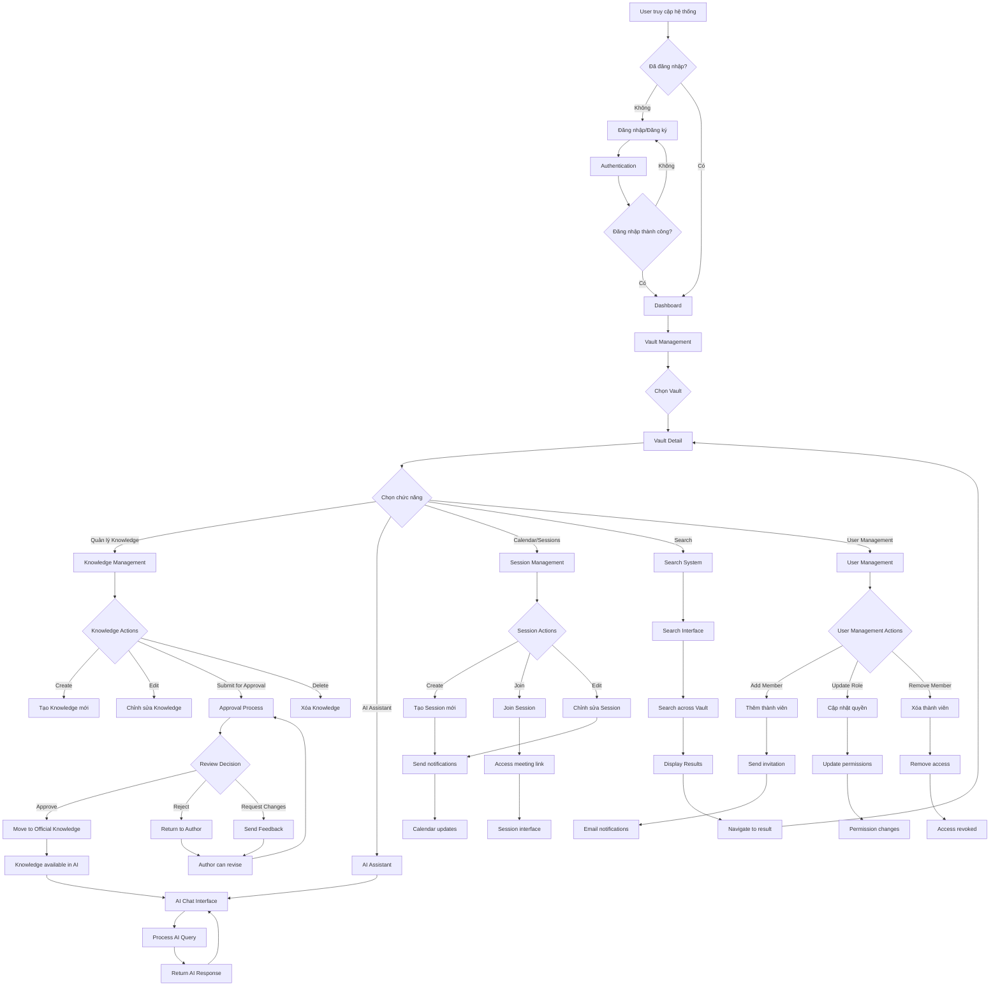

# HiveWise KMS - Main Workflow Summary

## 🎯 Workflow Chính của Hệ thống



## 🔄 Các Luồng Xử lý Chính

### 1. **Knowledge Lifecycle**
```
Draft → Submit → Pending → [Approve/Reject/Request Changes] → Official/Return
```

### 2. **User Journey**
```
Login → Dashboard → Vault → Folder → Knowledge → Actions
```

### 3. **AI Assistant Flow**
```
Question → Vector Search → Context Retrieval → AI Processing → Response
```

### 4. **Session Management**
```
Create → Schedule → Notify → Join → Conduct → Archive
```

### 5. **Search Process**
```
Query → Multi-source Search → Rank Results → Display → Navigate
```

## 🎯 Điểm Quan trọng

### **Security Checkpoints**
- ✅ Authentication required for all actions
- ✅ Role-based access control
- ✅ Permission validation at each step
- ✅ Session management

### **Data Integrity**
- ✅ Input validation
- ✅ Business rule enforcement
- ✅ State management
- ✅ Audit trail

### **User Experience**
- ✅ Intuitive navigation
- ✅ Real-time feedback
- ✅ Responsive design
- ✅ Error handling

### **Performance**
- ✅ Caching strategies
- ✅ Database optimization
- ✅ Async processing
- ✅ Load balancing ready

