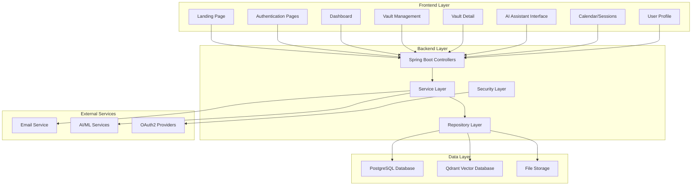
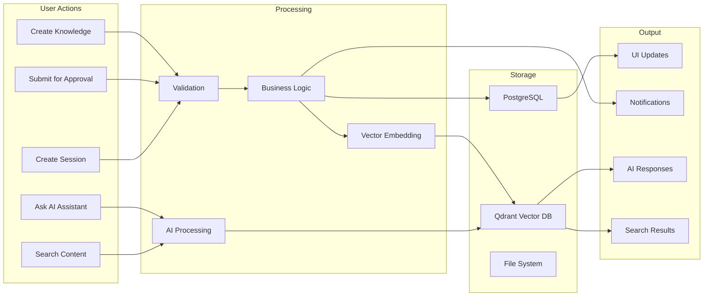
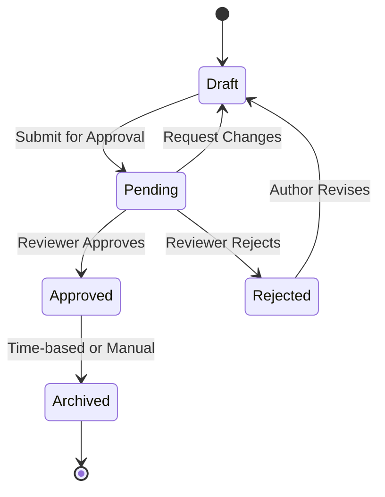
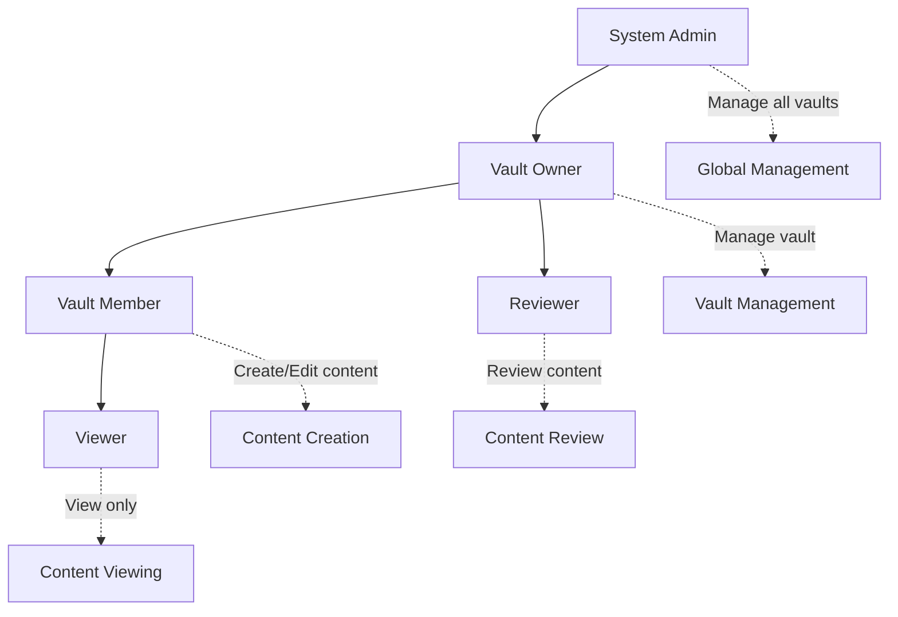
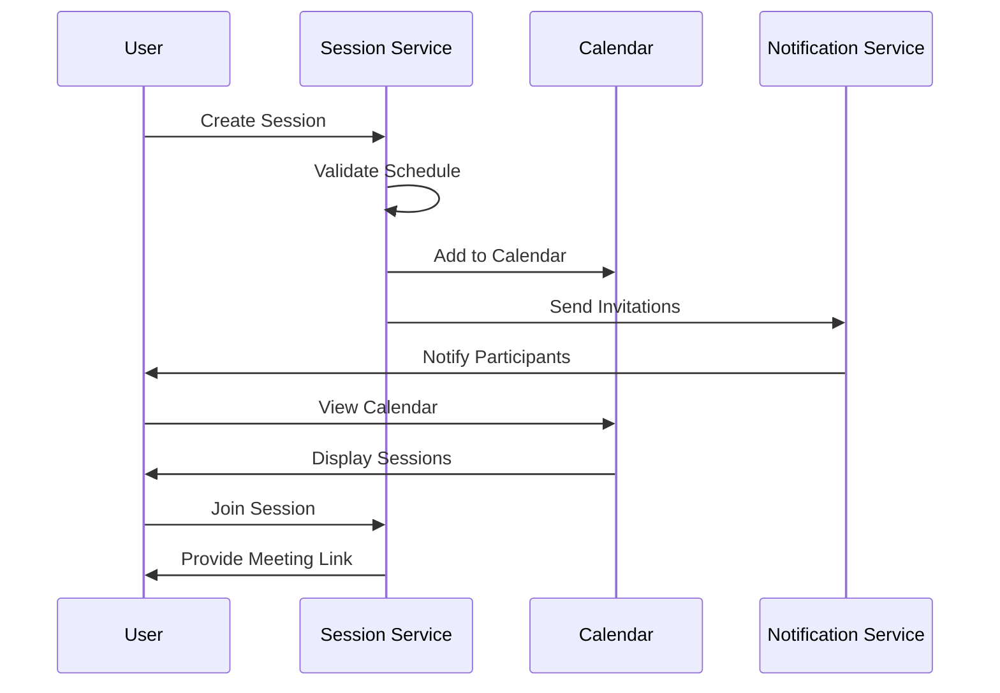
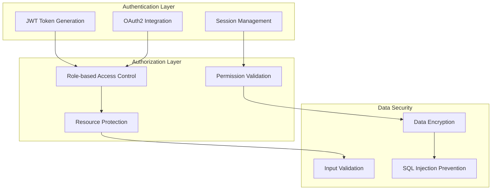
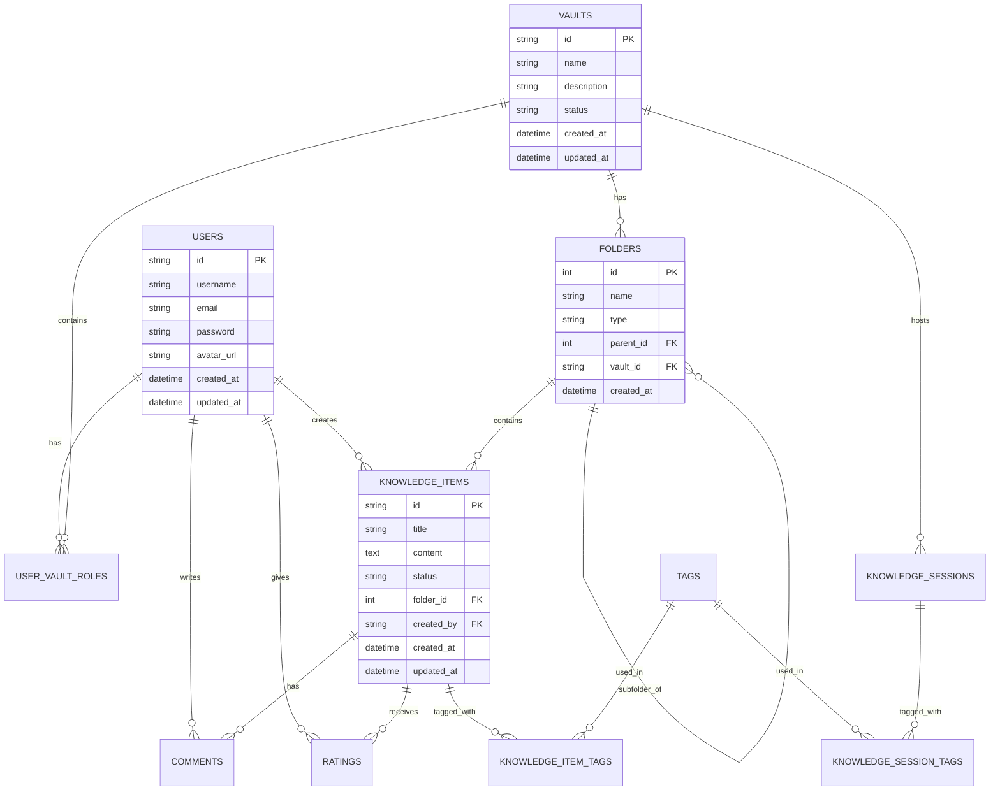
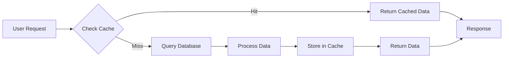
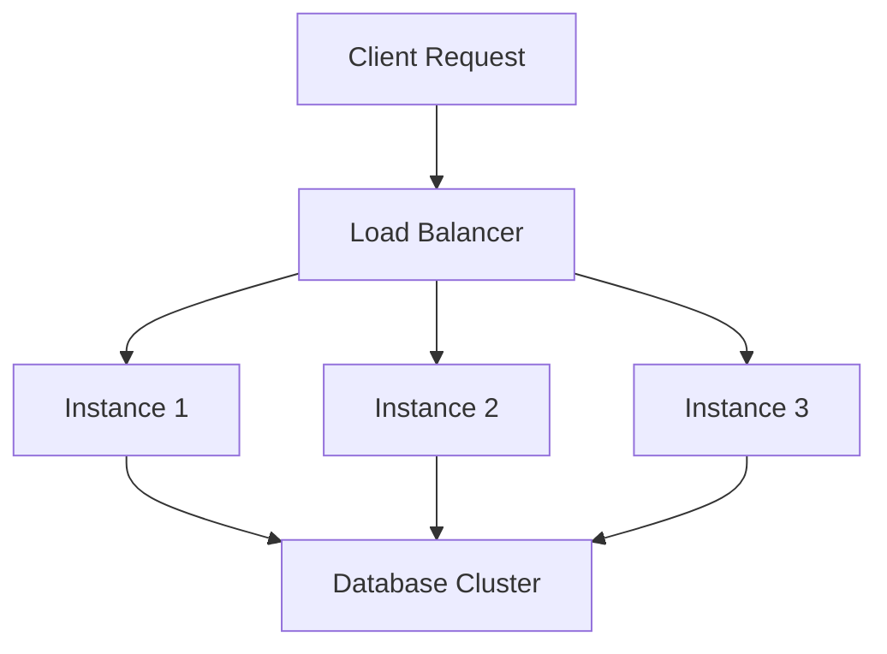
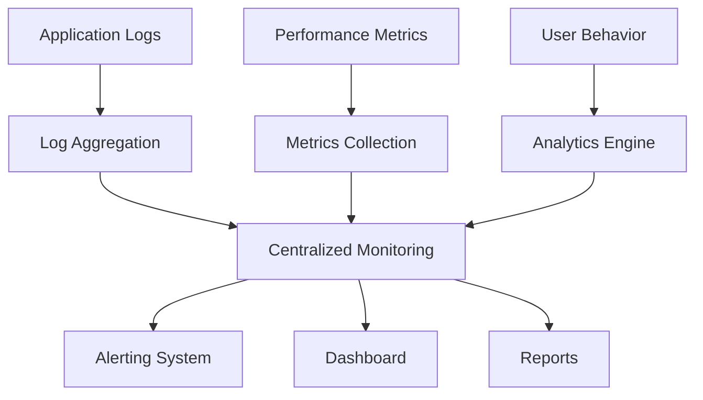

# HiveWise KMS - System Architecture Overview

## 🏗️ Kiến trúc Tổng quan

## 🔄 Data Flow Diagram

## 🎯 Core Business Processes

### 1. Knowledge Management Lifecycle

### 2. User Role Hierarchy

### 3. Session Management Flow

## 🔐 Security Architecture

## 📊 Database Schema Overview

## 🚀 Performance & Scalability

### Caching Strategy

### Load Balancing

## 🔧 Technology Stack

### Frontend
- **HTML5/CSS3/JavaScript**
- **Thymeleaf** (Server-side templating)
- **Bootstrap** (UI Framework)
- **Quill.js** (Rich Text Editor)

### Backend
- **Spring Boot 2.x**
- **Spring Security** (Authentication & Authorization)
- **Spring Data JPA** (Database access)
- **JWT** (Token-based authentication)

### Database
- **PostgreSQL** (Primary database)
- **Qdrant** (Vector database for AI)
- **File System** (Document storage)

### External Services
- **Email Service** (SMTP)
- **OAuth2** (Google, etc.)
- **AI/ML Services** (Vector embeddings, NLP)

## 📈 Monitoring & Analytics

## 🎯 Key Performance Indicators (KPIs)

### User Engagement
- Daily/Monthly Active Users
- Knowledge Items Created
- Sessions Attended
- AI Assistant Usage

### System Performance
- Response Time
- Uptime Availability
- Error Rates
- Database Query Performance

### Business Metrics
- Knowledge Approval Rate
- User Adoption Rate
- Content Quality Score
- Search Success Rate

